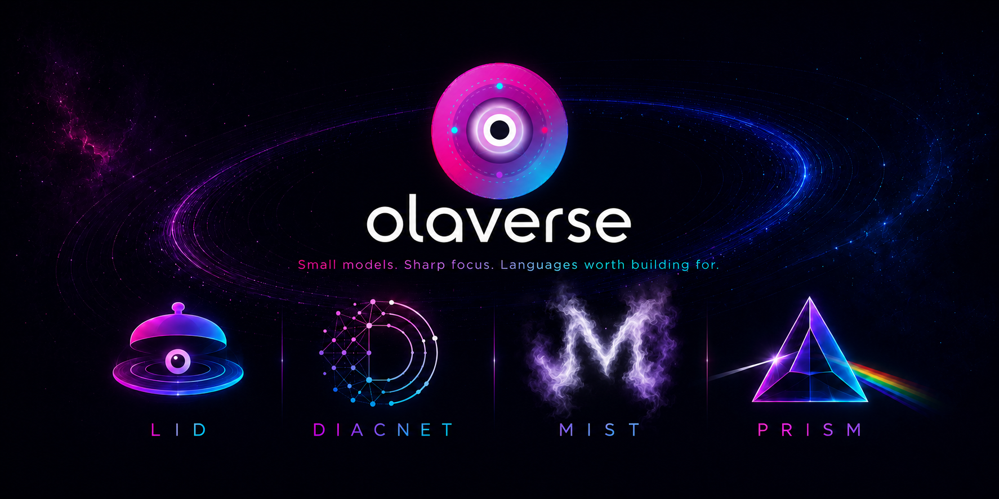

<div class="ov-hero">
  <div class="ov-hero-badge">v{{ olaverse_version }} — Now with Title & Question Generation</div>
  <h1 class="ov-hero-title">The Olaverse SDK</h1>
  <p class="ov-hero-sub">Open-source NLP infrastructure for underrepresented languages</p>
  <div class="ov-hero-install">
    <span class="ov-hero-install-label">pip install olaverse</span>
  </div>
  <div class="ov-hero-links">
    <a href="models/" class="md-button md-button--primary">Explore Models</a>
    <a href="https://github.com/Olaverse-Labs/olaverse" class="md-button" target="_blank">GitHub</a>
    <a href="https://huggingface.co/olaverse" class="md-button" target="_blank">Hugging Face</a>
  </div>
</div>

---

## 30-Second Quick Start

```bash
pip install olaverse
```

```python
from olaverse.nlp import Diacritizer

d = Diacritizer(model="auto")   # detects the language, routes to the right model

d.restore("Ojo lo si oja lana")     # Yoruba
# → 'Òjó lọ sí ọjà lana'

d.restore("Kedu ka i mere")         # Igbo
# → 'Kedụ ka ị mere'
```

Need more languages? The multilingual [`diacnet-1.0`](models/diacnet.md) model covers 10 — with `pip install olaverse[deeplearning]`:

```python
d = Diacritizer(model="diacnet-1.0", lang="yo")

d.restore("se eranko naa si gbo o?")
# → 'ṣé ẹranko náà sì gbọ́ ọ?'
```

---

## What is Olaverse?

**Olaverse** is an open-source multilingual AI infrastructure toolkit for building NLP, speech, retrieval, and language systems for underrepresented languages.

It gives you production-ready APIs for language detection, diacritization, tokenization, embeddings, reranking, and speech-text preprocessing — plus the MIST LLM family, domain LLMs, and lightweight vision models — all in one Python package.

---

## Why Olaverse?

### 1. Low-resource language support

Many languages lack high-quality AI tooling. Olaverse ships working models for them today:

- **Language detection** — 5 to 25 languages, from a 1.1 MB CPU model to neural classifiers
- **Diacritization** — restore tones and accents across 10 languages
- **Tokenization** — byte-level BPE tokenizers with 0% OOV, up to 63% fewer tokens than GPT-4 on Yoruba
- **Embeddings & retrieval** — cross-lingual semantic search for Hausa, Yoruba, Igbo
- **Speech preprocessing** — TTS text normalization for Yoruba, Igbo, and Nigerian Pidgin

### 2. Production-ready APIs

Instead of wrestling with `AutoModel.from_pretrained()`, checkpoints, and generation configs:

```python
Diacritizer(model="auto").restore(text)
LIDLite5().predict(text)
Reranker().rank(query, passages)
Tokenizer("yo").encode(text)
```

Correct defaults — stop tokens, sampling parameters, model routing — are baked in.

### 3. Lightweight deployment

Models are sized for real infrastructure, not just research clusters:

- `LIDLite5` — **1.1 MB**, 0.014 ms per sentence, pure Python, zero GPU
- `diacnet-yor-viterbi` — ~7 MB, fast CPU inference
- `Reranker` (22.7M) — 23 MB cross-encoder
- Prism vision models — ~25K-parameter upscalers that run anywhere

---

## Core Capabilities

<div class="ov-grid">

<div class="ov-card">
  <div class="ov-card-icon">🗣️</div>
  <div class="ov-card-title">NLP & Tokenization</div>
  <div class="ov-card-body">Diacritization for 10 languages, language detection for 5–25 languages, Byte-Level BPE tokenizers with 0% OOV, PII masking, and TTS text normalization.</div>
  <a href="nlp/" class="ov-card-link">Explore NLP →</a>
</div>

<div class="ov-card">
  <div class="ov-card-icon">⚡</div>
  <div class="ov-card-title">MIST Model Family</div>
  <div class="ov-card-body">8B, 70B, 140B, and Thinking variants. Correct stop tokens and sampling defaults per variant baked in. Local via <code>transformers</code> or hosted via Featherless/Modal.</div>
  <a href="models/mist/" class="ov-card-link">Explore MIST →</a>
</div>

<div class="ov-card">
  <div class="ov-card-icon">🧠</div>
  <div class="ov-card-title">Domain LLMs</div>
  <div class="ov-card-body"><code>LegalPeace</code> — fine-tuned Mistral-7B for contract analysis and legal reasoning. Memory-efficient 4-bit inference via unsloth.</div>
  <a href="models/legalpeace/" class="ov-card-link">Explore LLMs →</a>
</div>

<div class="ov-card">
  <div class="ov-card-icon">🎙️</div>
  <div class="ov-card-title">Speech Architecture</div>
  <div class="ov-card-body">TTS pipeline connecting normalization, diacritization, acoustic model, and vocoder. The NLP front-end is production-ready. Acoustic synthesis is on the roadmap.</div>
  <a href="speech/" class="ov-card-link">Explore Speech →</a>
</div>

<div class="ov-card">
  <div class="ov-card-icon">🔎</div>
  <div class="ov-card-title">Retrieval</div>
  <div class="ov-card-body">Cross-encoder <code>Reranker</code> for RAG/search pipelines, and a Nigerian-language <code>Embedder</code> for cross-lingual semantic search over Hausa, Yoruba, and Igbo.</div>
  <a href="models/retrieval/" class="ov-card-link">Explore Retrieval →</a>
</div>

<div class="ov-card">
  <div class="ov-card-icon">🖼️</div>
  <div class="ov-card-title">Vision — Prism</div>
  <div class="ov-card-body">Lightweight image-to-image models: <code>PrismUpscaler</code> (2x/4x/arbitrary), <code>PrismDenoiser</code>, and <code>PrismSteganography</code> for hiding recoverable messages in images.</div>
  <a href="models/prism/" class="ov-card-link">Explore Vision →</a>
</div>

<div class="ov-card">
  <div class="ov-card-icon">📊</div>
  <div class="ov-card-title">Datasets</div>
  <div class="ov-card-body">One-line access to every public olaverse dataset: reranker training pairs, multilingual QG passages, and the DiacBench diacritization benchmark.</div>
  <a href="datasets/" class="ov-card-link">Explore Datasets →</a>
</div>

</div>

---

## Featured Models

| Model | What it does | Size | Start here |
|---|---|---|---|
| **DiacNet** | Restores accents, tones & special characters in 10 languages | 1 MB – 503 MB | [DiacNet →](models/diacnet.md) |
| **LID family** | Language detection, 5–25 languages | 1.1 MB – 500 MB | [Language Detection →](models/language-detection.md) |
| **OTK-BPE** | Tokenizers for 8+ languages, 0% OOV | ~3 MB each | [Tokenizers →](models/tokenizers.md) |
| **Reranker / Embedder** | RAG & cross-lingual search | 23 MB+ | [Retrieval →](models/retrieval.md) |
| **MIST** | General LLMs — 8B / 70B / 140B / Thinking | 15 – 256 GB | [MIST →](models/mist.md) |
| **Prism** | Image upscaling, denoising, steganography | ~25K params+ | [Prism →](models/prism.md) |

Full catalog with comparison tables: **[Model Overview →](models/index.md)**

---

## Use Cases

Olaverse components slot into production pipelines for:

- **Speech AI** — ASR post-processing → normalization → diacritization → TTS front-end
- **OCR correction** — restore diacritics that scanners drop
- **Search** — language detection, query normalization, cross-lingual retrieval, reranking
- **Education** — language-learning tools with correct tone marks
- **Customer support** — detect and route messages in Nigerian languages and Pidgin
- **Translation pipelines** — clean, diacritized input for MT systems

See **[Solutions →](solutions.md)** for worked examples.

---

## Benchmarks

| Model | Size | Speed | Macro F1 |
|---|---|---|---|
| `LIDLite5` | 1.1 MB | 0.014 ms | 98.12% |
| `LIDNeural5` | 484 MB | 13.3 ms | 98.96% |

All published numbers — LID, diacritization, tokenizer efficiency — in one place: **[Benchmarks →](benchmarks.md)**

---

## Install

=== "Core"
    ```bash
    pip install olaverse
    ```
    Includes: NLP tools, diacritizers, tokenizers, lightweight LID, PII masking.

=== "Neural Models"
    ```bash
    pip install olaverse[deeplearning]
    ```
    Adds: `LIDNeural5`, `diacnet-1.0`, MIST local inference (requires GPU).

=== "Hosted Inference"
    ```bash
    pip install olaverse[hosted]
    ```
    Adds: MIST via Featherless, Modal, or any OpenAI-compatible endpoint.

=== "Legal"
    ```bash
    pip install olaverse[legal]
    ```
    Adds: `LegalPeace` contract analysis model (requires GPU + unsloth).

=== "LID (25 languages)"
    ```bash
    pip install olaverse[lid]
    ```
    Adds: `LIDLite25` — CPU-only fastText language ID for 25 languages.

=== "Retrieval"
    ```bash
    pip install olaverse[retrieval]
    ```
    Adds: `Reranker`, `Embedder` (requires `sentence-transformers`).

=== "Vision"
    ```bash
    pip install olaverse[vision]
    ```
    Adds: `PrismUpscaler`, `PrismDenoiser`, `PrismSteganography` (requires `torch`, `torchvision`, `Pillow`).

=== "Datasets"
    ```bash
    pip install olaverse[data]
    ```
    Adds: `load_dataset` — every public olaverse dataset on Hugging Face.

=== "Everything"
    ```bash
    pip install olaverse[deeplearning,hosted,legal,lid,retrieval,vision,data]
    ```

---

## Supported Languages

<div class="ov-lang-row">
  <span class="ov-lang-badge ov-lang-yor">Yoruba <code>yor</code></span>
  <span class="ov-lang-badge ov-lang-ibo">Igbo <code>ibo</code></span>
  <span class="ov-lang-badge ov-lang-hau">Hausa <code>hau</code></span>
  <span class="ov-lang-badge ov-lang-pcm">Nigerian Pidgin <code>pcm</code></span>
  <span class="ov-lang-badge ov-lang-eng">English <code>eng</code></span>
</div>

| Feature | yor | ibo | hau | pcm | eng |
|---|:---:|:---:|:---:|:---:|:---:|
| Language Detection (LIDLite5 / LIDNeural5) | ✅ | ✅ | ✅ | ✅ | ✅ |
| Diacritization | ✅ | ✅ | ✅ (diacnet-1.0) | — | — |
| BPE Tokenizer | ✅ | ✅ | ✅ | ✅ | via naija |
| TTS Normalization | ✅ | ✅ | — | ✅ | — |

Beyond Nigerian languages: `LIDLite25`/`LIDNeural25` detect **25 languages**; `diacnet-1.0` diacritizes **10** (incl. Vietnamese, Polish, Turkish, Portuguese, Spanish, French, Italian); OTK-BPE tokenizers cover **Swahili and Kinyarwanda**.

---

## What's New in v0.2.0

- **`MISTTitleGenerator`** — short chat titles from a user's first message, wrapping `mist-tg-0.3b`
- **`MISTQuestionGenerator`** — search-style question generation from a passage across 25 languages, wrapping `mist-qg-1.5b`. Useful as an endpoint, or as a data factory minting `(query, positive)` pairs to train retrievers
- **`diacnet-1.0` no longer truncates long text** — the model was trained on sentence-length input, so multi-sentence text is now segmented, restored a sentence at a time, and rejoined. Previously a 358-character paragraph came back at 235 characters with its tail dropped. Override with `split_sentences=False` or your own `splitter=`
- **Corrected model documentation** — every documented example was re-run against the real checkpoints, and the claims that didn't hold were fixed (see the [changelog](changelog.md))

**Previously, in v0.1.5:**

- **25-language identification** — `LIDLite25` (fastText) and `LIDNeural25` (XLM-RoBERTa) extend language detection well beyond the original 5 Nigerian languages; `LIDNeural5_1` adds a compact Nigerian-only classifier built on the new `mist-encoder-base-ng`
- **`diacnet-1.0`** — a single multilingual ByT5 model restores diacritics across 10 languages (Yoruba, Igbo, Hausa, Vietnamese, Polish, Turkish, Portuguese, Spanish, French, Italian), added to `Diacritizer` via `lang=`
- **OTK-BPE multilingual tokenizer family** — Swahili, Kinyarwanda, and a merged French/Kinyarwanda/English/Swahili tokenizer, each at 50k/100k/150k vocab, available through the same `Tokenizer` class
- **New `olaverse.nlp` retrieval toolkit** — `Reranker` (cross-encoder, 2 sizes) and `Embedder` (cross-lingual Hausa/Yoruba/Igbo sentence embeddings) for RAG/search pipelines
- **New `olaverse.vision` module** — `PrismUpscaler`, `PrismDenoiser`, and `PrismSteganography`, general-purpose image-to-image models
- **New extras**: `olaverse[lid]`, `olaverse[retrieval]`, `olaverse[vision]`

**Previously, in v0.1.4:**

- **`MIST` wrapper** — unified interface for all MIST variants with correct stop tokens, sampling defaults, and local/hosted endpoint switching
- **`LIDNeural5` moved to `olaverse.nlp`** — its correct home alongside `LIDLite5` (backward-compat import from `olaverse.llm` preserved)
- **`ExperimentalWarning`** on speech classes — honest signalling that acoustic synthesis is not yet available
- **`olaverse[hosted]`** extra — `pip install olaverse[hosted]` for Featherless/Modal inference

---

## Commercial Support

Need custom language support, fine-tuning, or deployment help? We work with teams adding underrepresented-language capability to their products. **[Learn more →](enterprise.md)**
